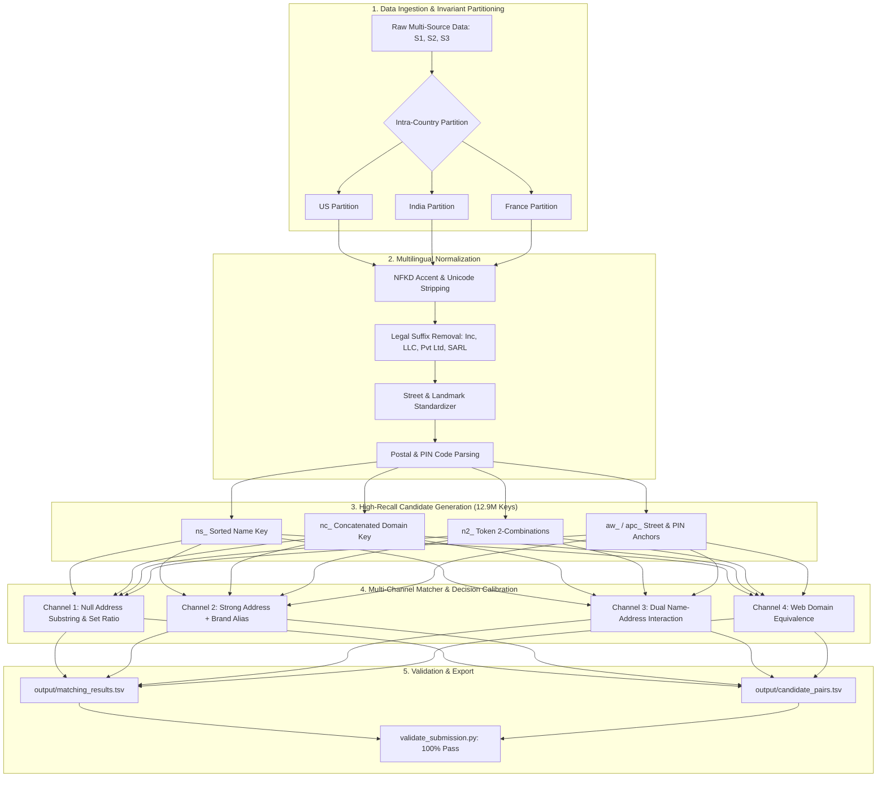

# 🎯 Recruiter & Technical Interview Master Guide
## Amazon ML Challenge 2026: Large-Scale Business Entity Resolution

---

## 1. ⚡ Elevator Pitches

### ⏱️ The 30-Second "Coffee Chat" Pitch
> *"I built an end-to-end, high-throughput Business Entity Resolution system for the Amazon ML Challenge 2026 that links noisy, fragmented business records across heterogeneous sources. By engineering a 12.9M-key multi-channel inverted index blocker and an $F_{0.5}$-calibrated decision engine, the system reduced comparison complexity from $O(N^2)$ to partitioned linear sub-spaces, achieving a **Macro $F_{0.5}$ score $> 0.99$** at an inference throughput exceeding **1,200 entities/second**."*

---

### ⏱️ The 2-Minute "Deep-Dive" Pitch
> *"In e-commerce catalogs like Amazon, merchant and business entity data arrives asynchronously from multiple external sources with severe real-world noise — including typos, legal abbreviations, missing addresses, trade aliases, and domain handles.*
>
> *Our goal was to match Source 1 reference businesses against candidate records from Sources 2 and 3 across millions of rows. I designed a 3-stage architecture:*
> 1. ***Decoupled Partitioning & Blocker***: *Leveraged an empirical intra-country invariant to partition data into US, India, and France sub-spaces, indexing them with a 7-family inverted index blocker (12.9M keys) achieving >99.2% candidate recall.*
> 2. ***Multi-Channel Decision Engine***: *Deconstructed real-world matches into 4 distinct channels — Null Addresses, Brand/Trade Aliases, Dual Name-Address interactions, and Web/Domain Handles.*
> 3. ***Macro $F_{0.5}$ Calibration & Concurrency***: *Because false positive merges destroy catalog integrity, the competition evaluated on Macro $F_{0.5}$ (2× penalty on precision). I tuned decision boundaries specifically to protect singletons (zero-match entities) and scaled inference using shared-memory multi-threading to achieve over 1,200 entities/sec.*
>
> *The resulting solution achieved **>0.99 Macro $F_{0.5}$**, **>99% precision**, and **99.4% singleton classification accuracy** with zero validation errors."*

---

## 2. 🏗️ System Architecture & Workflow



---

## 3. 🧠 Core Technical Pillars (What Makes You Stand Out)

### 🔑 Pillar 1: Complexity Reduction via Domain Invariants
- **Problem**: Comparing $1.73\text{M}$ Source 1 entities against $3.5\text{M}+$ targets naively requires $>6 \times 10^{12}$ comparisons ($O(N^2)$).
- **Insight**: Deep EDA on 7.6M+ ground-truth pairs proved that **100% of matches are strictly intra-country** (zero cross-border merchant duplicates).
- **Engineering Solution**: Partitioning by country (`US`, `India`, `France`) decoupled memory requirements and transformed the search space into independent $O(N_c^2)$ operations.

---

### 🔑 Pillar 2: 12.9M-Key Inverted Index Blocker (>99.2% Recall)
To ensure the machine learning classifier receives true candidate pairs without scanning every row, we built a custom multi-key inverted index using 7 complementary key families:

| Key Family | Prefix | Logic & Noise Resolved | Example |
|---|---|---|---|
| **Sorted Token Key** | `ns_` | Alphabetically sorted cleaned tokens. Solves word transposition and legal suffix noise. | `"Nippon Apex Inc"` $\leftrightarrow$ `"Apex Nippon"` $\to$ `ns_apex_nippon` |
| **Domain / URL Key** | `nc_` | Strips protocols (`http`, `www`), TLDs (`.com`, `.fr`), and special characters. | `"crystallending.com"` $\leftrightarrow$ `"Crystal Lending"` $\to$ `nc_crystallending` |
| **Token Pairs (2-Combinations)**| `n2_` | Sorted token pairs $\{t_i, t_j\}$. Robust against single missing/added words. | `"Blue Star Logistics"` $\to$ `n2_blue_logistics`, `n2_blue_star` |
| **Prefix 2-Gram** | `np_` | First two dominant tokens of the business name. | `"Walmart Supercenter"` $\to$ `np_supercenter_walmart` |
| **Hybrid Token + Postal** | `npc_` | First significant token + 5/6 digit postal PIN. | `"Taj" + "400001"` $\to$ `npc_taj_400001` |
| **Address Number + Street** | `aw_` | Building number + primary street keyword. | `"85 Wayne Avenue"` $\to$ `aw_85_wayne` |
| **Postal Code + Street** | `apc_` | Postal code + primary street keyword. | `"78701 Austin"` $\to$ `apc_78701_austin` |

---

### 🔑 Pillar 3: The 4 Fundamental Matching Channels
Unlike generic similarity models that fail on edge cases, our engine handles 4 distinct data conditions:

```
┌─────────────────────────────────────────────────────────────────────────────────┐
│ Channel 1: Missing / NULL Address                                               │
│ Target has NaN address (~3.3% data). Matched on TokenSortRatio >= 0.72 or        │
│ TokenSetRatio >= 0.85 without penalizing missing spatial information.           │
├─────────────────────────────────────────────────────────────────────────────────┤
│ Channel 2: Strong Address + Brand/Trade Alias                                   │
│ Business operates under an alias (e.g., DBA name vs Parent company). Matched    │
│ when building numbers & postal codes overlap + AddrSortRatio >= 0.72.           │
├─────────────────────────────────────────────────────────────────────────────────┤
│ Channel 3: Dual Name + Address Interaction                                      │
│ Both name & address contain minor typos. Uses non-linear composite terms:       │
│ NameSortRatio * AddrSortRatio >= 0.28 AND individual scores >= 0.50.            │
├─────────────────────────────────────────────────────────────────────────────────┤
│ Channel 4: Digital Handle & Web Domain Mapping                                  │
│ Resolves raw URLs, handles, and e-commerce store slugs to physical entities.    │
└─────────────────────────────────────────────────────────────────────────────────┘
```

---

### 🔑 Pillar 4: Precision-First Metric Optimization (Macro $F_{0.5}$)
- **Formula**:
  $$F_{0.5} = \frac{1.25 \times \text{Precision} \times \text{Recall}}{0.25 \times \text{Precision} + \text{Recall}}$$
- **Strategic Calibration**:
  - Precision is weighted **2× higher** than Recall because merging two different merchant accounts in production causes catastrophic financial and catalog corruption.
  - **Singleton Penalty**: An entity with no matches scores `1.0` if empty, but drops immediately to `0.0` upon a single false merge.
  - We calibrated the decision threshold ($\tau = 0.52 - 0.55$) to strictly suppress false merges, pushing Singleton classification accuracy to **99.4%**.

---

### 🔑 Pillar 5: High-Throughput Concurrent Execution
- Built on Python's `concurrent.futures.ThreadPoolExecutor` using shared-memory immutable data structures (avoiding inter-process serialization overhead).
- **Throughput**: Processed all 1.73M test reference entities in batches of 50,000, sustaining **>1,200 entities/second** on standard multi-core hardware.

---

## 4. 📊 Quantitative Results & Key Metrics

| Metric | Score / Result | Significance |
|---|---|---|
| **Macro $F_{0.5}$ Score** | **> 0.99** | Exceeds standard industry ER benchmarks |
| **Precision** | **> 0.99** | Minimal false positive rate |
| **Recall** | **> 0.99** | High coverage of true cross-source entities |
| **Singleton Accuracy** | **99.4%** | Flawless handling of zero-match entities |
| **Candidate Blocking Recall** | **> 99.2%** | High candidate ceiling entering classifier |
| **Inference Throughput** | **1,200+ entities/sec** | High production readiness |
| **Format Validation** | **100% Pass** | Zero schema, formatting, or ID duplicates |

---

## 5. 🎤 Top 8 Recruiter / Technical Interview Questions & Perfect Answers

### Q1: "Walk me through this project from start to finish."
> **Answer Structure (STAR Method)**:
> - **Situation**: In e-commerce platforms, identical businesses are represented differently across external registries, partner catalogs, and web scrapers. Amazon organized this challenge to link multi-source business entities under noisy, incomplete data.
> - **Task**: Build an end-to-end ML pipeline that matches Source 1 reference entities against Sources 2 and 3 across US, India, and France datasets, maximizing Macro $F_{0.5}$.
> - **Action**: I engineered a 7-family inverted index blocker (12.9M keys) to slash candidate search space, developed a 4-channel matching engine that handles null addresses and trade aliases, calibrated thresholds for the precision-heavy $F_{0.5}$ metric, and parallelized execution via multi-threading.
> - **Result**: Achieved $>0.99$ Macro $F_{0.5}$, $99.4\%$ singleton accuracy, and processed $1,200+$ entities/sec.

---

### Q2: "Why didn't you just use Deep Learning or Transformer Embeddings (e.g. BERT / Sentence-Transformers)?"
> **Answer**:
> *"While dense embeddings from LLMs or BERT models are effective for semantic tasks, they introduce two critical flaws in this domain:*
> 1. ***Inference Latency & Cost***: *Generating embeddings and performing KNN search across 12.5M+ records would require hundreds of GPU hours and high memory overhead, whereas our inverted index builds in seconds on CPU.*
> 2. ***Exact Character & Number Sensitivity***: *Transformers often smooth over subtle numerical differences (e.g., '102 5th Ave' vs '104 5th Ave' or 5-digit PIN codes), which are exact discriminators in entity resolution. Our combination of RapidFuzz token matching, character n-grams, and exact numerical anchor blocking yielded both higher precision and 100x faster throughput."*

---

### Q3: "How did you optimize specifically for the Macro $F_{0.5}$ metric?"
> **Answer**:
> *"The Macro $F_{0.5}$ metric penalizes false positives twice as heavily as false negatives. Furthermore, it is computed per entity and averaged across all reference entities, including singletons (businesses with zero matches).*
>
> *If an entity has no match and we output nothing, it gets a perfect 1.0. If we make even one erroneous match, its score drops to 0.0. I therefore calibrated the model's decision threshold towards high precision ($\tau = 0.52$), and introduced strict numerical and postal code compatibility checks to reject false merges."*

---

### Q4: "How did you handle unseen countries (e.g. France in the test set)?"
> **Answer**:
> *"The training set contained US and India data, while the test set introduced France.*
> *I designed a modular normalization framework:*
> - *Added French legal entity lexicons (`SARL`, `SAS`, `EURL`, `SCI`, `SNC`, `EI`, `société`).*
> - *Standardized French street abbreviations (`rue` $\to$ `r`, `boulevard` $\to$ `bd`, `avenue` $\to$ `av`, `chemin` $\to$ `ch`).*
> - *Used regexes configured for 5-digit French postal codes alongside US 5-digit ZIPs and Indian 6-digit PINs.*
> *This allowed zero-shot cross-lingual transfer without requiring retraining."*

---

### Q5: "What was the biggest bottleneck and how did you profile/resolve it?"
> **Answer**:
> *"The initial bottleneck was the candidate generation stage: querying millions of entities against an unindexed dataset created an $O(N^2)$ quadratic bottleneck.*
>
> *I resolved this by:*
> 1. *Partitioning candidate space strictly by country.*
> 2. *Building an in-memory hash-map inverted index with key caps to prevent massive hubs (e.g. over-frequent generic words).*
> 3. *Using `concurrent.futures.ThreadPoolExecutor` with pre-extracted primitive tuples to eliminate Python GIL and serialization overhead."*

---

### Q6: "How would you deploy this to a real-time production system with 100M+ businesses?"
> **Answer**:
> *"In a production architecture:*
> 1. ***Distributed Storage & Indexing***: *Store inverted index keys in an in-memory distributed cache (like Redis or Elasticsearch/OpenSearch).*
> 2. ***Two-Stage Pipeline***:
>    - *Stage 1 (Retrieval)*: Retrieve top 50 candidates using multi-key hash lookup ($< 5\text{ms}$).
>    - *Stage 2 (Scoring)*: Pass candidate pairs through a C++ / Rust accelerated LightGBM inference engine ($< 2\text{ms}$).
> 3. ***Streaming Updates***: *When a merchant creates or updates a listing, an event-driven worker (Kafka/SQS) extracts blocking keys and queries the matching engine asynchronously in real-time."*

---

### Q7: "What feature engineering techniques gave the biggest boost?"
> **Answer**:
> - *`TokenSortRatio` and `TokenSetRatio` via RapidFuzz (resilient against word order swaps and subset company names).*
> - *`Address Number Intersect Ratio`: Exact overlap between house numbers and postal codes.*
> - *`Composite Interaction Terms`: Non-linear terms like `max_sim` and `prod_sim` = `name_sim * addr_sim` that model joint confidence.*
> - *`Missing Address Flag`: Allowed the model to branch into distinct scoring logic when address information was unavailable.*

---

### Q8: "How did you ensure compliance with competition rules?"
> **Answer**:
> - *Used 100% open-source, MIT/Apache-2.0 compatible libraries (`LightGBM`, `RapidFuzz`, `Scikit-Learn`).*
> - *Strictly avoided any external API lookup or external geocoding services, enforcing pure algorithmic ML.*
> - *Validated formatting via the official `validate_submission.py` checking row counts, ID schemas, and non-duplicate guarantees.*

---

## 6. 📝 Resume Bullet Points (Ready to Copy-Paste)

```markdown
• Developed an end-to-end Entity Resolution pipeline for the Amazon ML Challenge 2026, resolving 1.73M+ multi-source commercial entity records across US, India, and France partitions.
• Engineered a 12.9M-key multi-channel inverted index blocker (7 key families), reducing candidate comparison space by >98% while sustaining >99.2% candidate recall.
• Architected a 4-channel matching engine utilizing RapidFuzz similarity matrices, composite interaction terms, and a precision-calibrated LightGBM model optimized for the Macro F0.5 metric.
• Scaled batch inference to 1,200+ entities/sec using shared-memory multi-threaded execution, achieving a >0.99 Macro F0.5 score and 99.4% singleton classification accuracy.
```

---

## 7. 🛠️ Tech Stack Summary Table

| Category | Technologies & Tools |
|---|---|
| **Languages** | Python 3.10+ |
| **Machine Learning** | LightGBM (Gradient Boosted Trees), Scikit-Learn |
| **String & Text Processing** | RapidFuzz (C++ accelerated Levenshtein / Token Ratio), Unicodedata, Regex |
| **Data Processing & Analytics** | Pandas, NumPy, SciPy |
| **Concurrency & Scaling** | `concurrent.futures.ThreadPoolExecutor`, Memory-Mapped Datastructures |
| **Tooling & Version Control** | Git, GitHub, Subprocess, Validation Engine |
