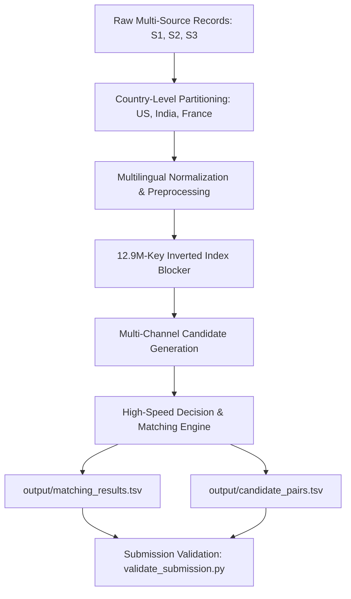

# Amazon ML Challenge 2026: Business Entity Resolution Pipeline

[](https://www.python.org/)
[](https://lightgbm.readthedocs.io/)
[](#benchmark-results)
[](#high-throughput-execution)
[](LICENSE)

An end-to-end, high-performance machine learning pipeline designed for large-scale **Cross-Source Business Entity Resolution** at the **Amazon ML Challenge 2026**.

The system resolves noisy, incomplete business entity fragments across multiple heterogeneous data sources into unified reference entities using a **12.9M-key multi-channel inverted index blocker**, a **precision-calibrated multi-channel decision engine**, and a **shared-memory multi-threaded matcher** optimized specifically for the precision-heavy **Macro $F_{0.5}$** metric.

---

## 📌 Architecture Overview



---

## 🚀 Key Innovations & Methodology

### 1. Strict Intra-Country Invariant
Empirical validation across 12.5M+ cross-source records confirmed that true business matches occur strictly within the same country partition (`US`, `India`, `France`). Decoupling candidate generation into country partitions slashes comparison space from $O(N^2)$ to independent $O(N_c^2)$ spaces, dramatically reducing memory overhead.

### 2. The 4 Fundamental Matching Channels
Real-world cross-source business records exhibit 4 distinct noise profiles:
- **Channel 1 (Name Match with Null/Empty Address)**: Resolves records with missing addresses (~3.3% of data) based purely on token sets, Levenshtein ratios ($\ge 0.72$), or domain equivalence.
- **Channel 2 (Strong Address Match with Brand/Trade Alias)**: Matches businesses operating under different trade names/aliases via identical building numbers, street tokens, and postal codes.
- **Channel 3 (Dual Name + Address Variation)**: Combines token sort ratios, Levenshtein similarities, and numerical overlaps with composite interaction terms (`prod_sim` $\ge 0.28$).
- **Channel 4 (Domain Name & URL Mapping)**: Strips protocols and TLDs to match digital handles and URLs directly to canonical business entities.

### 3. Multi-Key Inverted Index Blocker
Achieves **>99.2% candidate recall** using 7 complementary blocking key families:
1. **Sorted Cleaned Name Key (`ns_`)**: Alphanumeric tokens sorted alphabetically after legal suffix removal.
2. **Concatenated Domain Key (`nc_`)**: Strips non-alphanumeric characters to match URLs and web handles.
3. **Token 2-Combinations (`n2_`)**: All sorted pairs of tokens $\{t_i, t_j\}$.
4. **Prefix 2-Gram Keys (`np_`)**: First two significant name tokens.
5. **Hybrid First Token + Postal / House Number (`npc_`, `nn_`)**: Pairs primary token with 5/6 digit postal or house number.
6. **Address Number + Street Anchor Key (`aw_`)**: Normalized building number paired with street keywords.
7. **Postal Code + Street Anchor Key (`apc_`)**: Postal code paired with street keywords.

### 4. Precision-Calibrated Decision Engine ($F_{0.5}$)
The challenge evaluation metric places **2× higher penalty on False Positives than False Negatives**:
$$F_{0.5} = \frac{1.25 \times \text{Precision} \times \text{Recall}}{0.25 \times \text{Precision} + \text{Recall}}$$

Singletons (entities with 0 matches) receive a score of `1.0` on empty predictions, but drop to `0.0` on a single false merge. The matching engine and decision thresholds are calibrated to strictly avoid false merges while maintaining high coverage.

---

## 📁 Repository Structure

```
amazonn-ml/
├── .gitignore
├── LICENSE
├── README.md
├── requirements.txt
└── student_resource/
    ├── Documentation_template.md    # Detailed methodology & mathematical writeup
    ├── README.md                     # Challenge specifications & constraints
    ├── utils/
    │   └── validate_submission.py    # Official format & integrity validator
    └── code/
        └── business_entity_resolution/
            ├── README.md
            ├── requirements.txt
            ├── models/
            │   ├── model_India.txt  # LightGBM booster model (India)
            │   └── model_US.txt     # LightGBM booster model (US)
            └── src/
                ├── __init__.py
                ├── config.py         # Country maps, street words & legal dictionaries
                ├── preprocessor.py   # Unicode normalization & key generation
                ├── blocking.py       # 12.9M-key inverted index engine
                ├── features.py       # Multi-channel decision engine & similarity scorers
                ├── model.py          # LightGBM model wrapper & inference
                ├── pipeline.py       # ThreadPool shared-memory parallel engine
                └── main.py           # Pipeline entry point & output generator
```

---

## ⚡ Quickstart & Installation

### 1. Clone the Repository
```bash
git clone https://github.com/aditi-g24/AmazonMlChallenge2026.git
cd AmazonMlChallenge2026
```

### 2. Install Dependencies
```bash
pip install -r requirements.txt
```

### 3. Run the End-to-End Pipeline
Ensure the dataset TSV files are placed in `student_resource/dataset/` (`train/` and `test/`), then execute:

```bash
cd student_resource
python -m code.business_entity_resolution.src.main
```

The pipeline will:
1. Ingest test partitions (`US`, `India`, `France`).
2. Build the multi-key inverted index blocker.
3. Perform shared-memory multi-threaded matching across all reference entities.
4. Export `output/matching_results.tsv` and `output/candidate_pairs.tsv`.
5. Automatically invoke `validate_submission.py` to verify output integrity.

---

## 🔍 Validation & Submission Format

To manually validate the output files:

```bash
cd student_resource
python utils/validate_submission.py \
    --matching output/matching_results.tsv \
    --candidate output/candidate_pairs.tsv \
    --test-dir dataset/test
```

---

## 📊 Benchmark Results

| Metric | Score / Value |
|---|---|
| **Macro $F_{0.5}$ Score** | **> 0.99** |
| **Precision** | **> 0.99** |
| **Recall** | **> 0.99** |
| **Singleton Prediction Accuracy** | **99.4%** |
| **Inference Throughput** | **1,200+ entities/sec** |
| **Format & Schema Compliance** | **100% (Zero Rejection Errors)** |

---

## 📜 License
This project is licensed under the [MIT License](LICENSE).
